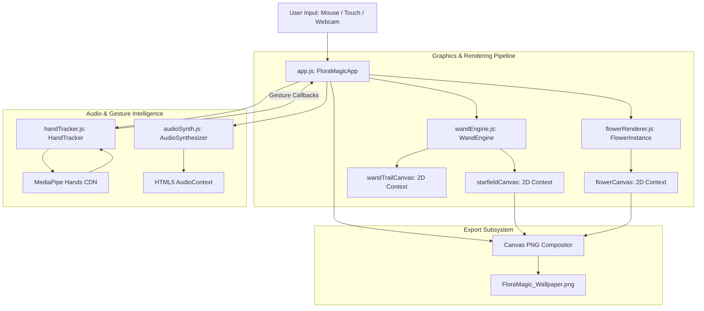

# 🏗️ FloraMagic Wand — Architecture & Software Design

This document details the architectural design, rendering pipeline, component hierarchy, and data flow of the **FloraMagic Wand** web application.

---

## 📐 System Architecture Diagram

---

## 🧩 Core Class Modules

### 1. Master Application Controller (`js/app.js`)
* **Class**: `FloraMagicApp`
* **Responsibilities**:
  - Initializes canvas dimensions and attaches responsive resize listeners.
  - Manages global state (`currentTheme`, `wandMode`, `flowerScale`, `density`, `windForce`, `petalCount`).
  - Drives the `requestAnimationFrame` render loop at 60 FPS.
  - Binds user interface HUD controls (sliders, theme grid, modal buttons).
  - Handles offscreen canvas compositing for high-resolution PNG wallpaper exports.

### 2. Wand Particle & Background Engine (`js/wandEngine.js`)
* **Class**: `WandEngine`
* **Responsibilities**:
  - Maintains background starfield array with dynamic twinkling alpha pulses.
  - Implements **Linear Interpolation (Lerp)** smoothing (`currentX += (targetX - currentX) * 0.35`) for fluid wand movement.
  - Emits and updates trail particles across four selectable visual modes (*Stardust*, *Firefly*, *Ribbon*, *Crystal*).
  - Draws custom glowing starburst crystal wand cursor at tip position.

### 3. Procedural Flower & Petal Renderer (`js/flowerRenderer.js`)
* **Classes**: `FlowerTheme`, `FlowerInstance`, `FloatingPetal`
* **Responsibilities**:
  - `FlowerTheme`: Encapsulates color palettes, petal vector shapes (*notched*, *pointed*, *rose*, *sunflower*, *cosmos*), and default petal counts.
  - `FlowerInstance`: Renders organic bloom growth from `scale: 0.05` to `targetSize` using spring easing. Computes multi-layered radial petal geometry, pistil radial gradient glow, stamens, and curved leaf stems.
  - `FloatingPetal`: Simulates wind-drift physics for detached petals with horizontal sine-wave wobble, rotational drift, and opacity decay.

### 4. Web Audio Synthesizer (`js/audioSynth.js`)
* **Class**: `AudioSynthesizer`
* **Responsibilities**:
  - Lazily initializes HTML5 `AudioContext` on initial user interaction to comply with browser autoplay policies.
  - Maps screen coordinates to pentatonic scale frequencies (Sakura, Lotus, Rose, Solar, Cosmos scales).
  - Creates dual-oscillator voice nodes (sine base chime + triangle octave bell) with exponential ramp gain envelopes and stereo panning.

### 5. MediaPipe Webcam Hand Tracker (`js/handTracker.js`)
* **Class**: `HandTracker`
* **Responsibilities**:
  - Wraps MediaPipe Hands CDN library.
  - Processes webcam video frames to extract 3D hand landmark coordinates.
  - Maps landmark 8 (Index Finger Tip) to screen coordinates as the physical wand tip.
  - Detects **Pinch Gesture** (Euclidean distance between thumb tip and index tip < 0.06) to trigger burst blooms.
  - Detects **Open Palm Gesture** (all finger tips extended above wrist) to trigger petal breeze clearing.

---

## ⚡ Performance & Optimization Strategies

1. **Multi-Canvas Layering**:
   - Canvas 1 (`#starfieldCanvas`): Low-frequency background star updates.
   - Canvas 2 (`#flowerCanvas`): Main procedural flower & floating petal drawing.
   - Canvas 3 (`#wandTrailCanvas`): High-frequency cursor wand tip and particle trail updates.
   - Using separate layered canvases avoids re-drawing complex flowers when only the wand cursor moves.

2. **Garbage Collection Minimization**:
   - Flowers fade out naturally (`opacity <= 0`) and are pruned from the `flowers[]` array in reverse loops to prevent array re-indexing overhead.

3. **Responsive High-DPI Canvas Handling**:
   - Canvases automatically resize on viewport changes using window inner dimensions (`window.innerWidth`, `window.innerHeight`).
